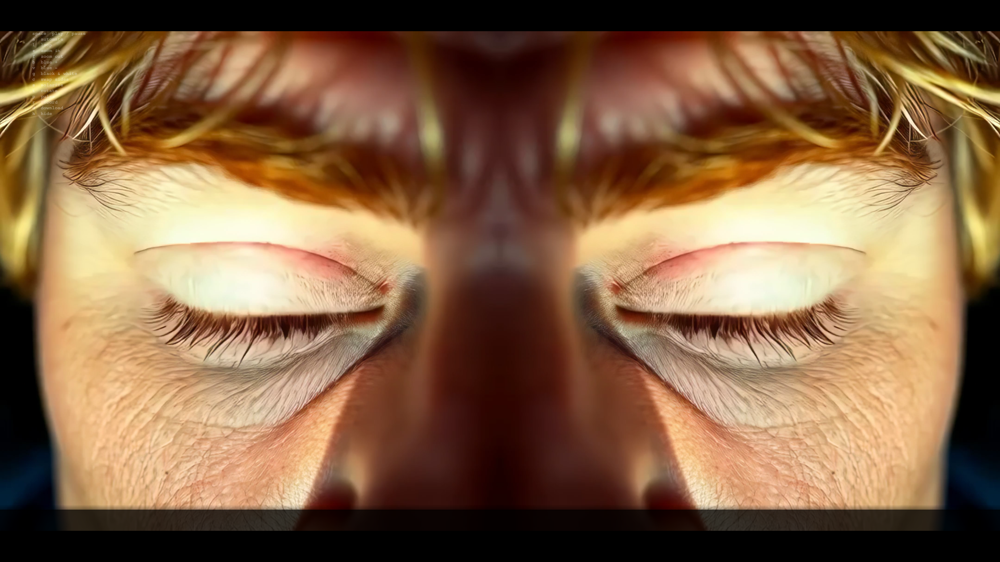
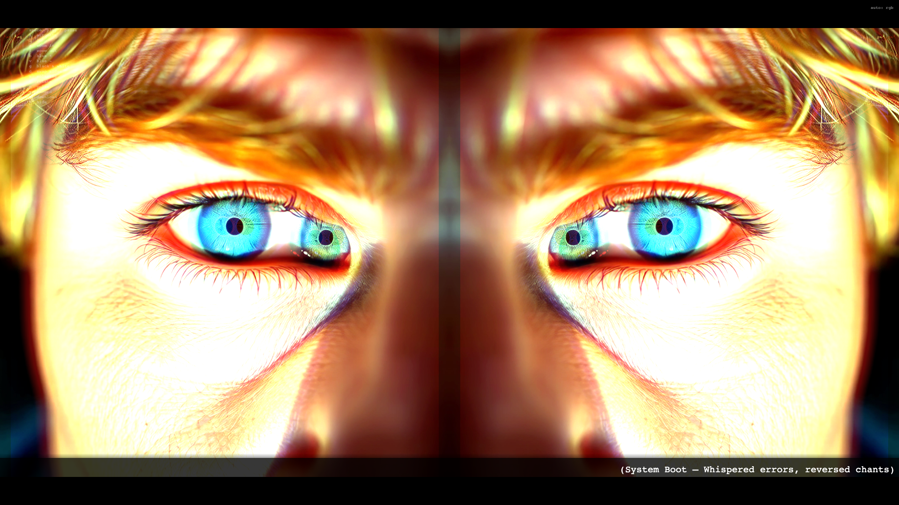

# Glitch Sanctum

**Glitch Sanctum** is an interactive audiovisual installation—a corrupted liturgy rendered as dual mirrored video, glitch-themed scrolling text, and music-reactive visual states. Faith becomes syntax error; the hymn scrolls in fragments while the image fractures, rotates, splits into RGB, pixelates, and pulses with the beat. Press **Space** to begin the rite.

The video loads **paused** on the first frame, doubled side by side—the right panel mirrored horizontally, like facing a corrupted reflection. With automation off, you can layer effects manually. Press **A** while playing to enter **automate** mode: the piece cycles through eight states every four seconds, each driven by bass, peaks, treble, and beat detection from the track.

## Screenshots

**Paused — dual mirrored panels**



**Automate — RGB channel split**



## Controls

| Key       | Action |
| --------- | ------ |
| **Space** | Play / pause |
| **A**     | Toggle **automate** — cycles music-reactive effect states |
| **L**     | Toggle loop |
| **Z**     | Zoom in (hold for slow drift) |
| **F**     | Zoom out (hold for slow drift) |
| **B**     | Increase blue saturation (manual, when automate is off) |
| **V**     | Decrease blue saturation |
| **G**     | Toggle black & white |
| **C**     | Swap left / right panels |
| **S**     | Toggle RGB channel split |
| **T**     | Toggle rotation (panels spin in opposite directions) |
| **P**     | Toggle pulse / shake |
| **R**     | Start / stop canvas recording |
| **D**     | Download recording as MP4 |
| **H**     | Hide / show on-screen hints |

Manual effect keys (**G**, **C**, **S**, **T**, **P**) are disabled while **automate** is on.

## Automate

When **automate** is off, the video plays with any manual effects you have toggled. Press **A** while playing to cycle through these states automatically (4 seconds each, synced to `video.time()`):

| State      | Effect |
| ---------- | ------ |
| **clean**  | Plain dual-panel video |
| **bw**     | Black & white |
| **rgb**    | Distinct R / G / B channel split, widens on beats |
| **change** | Left and right panels swapped |
| **rotate** | Opposite rotation per panel; speed follows the music |
| **pixelate** | Pulsating block pixelation driven by bass and peaks |
| **pulse**  | Scale and shake on the beat |
| **all**    | Combined: bw + swap + rgb + rotate + pixelate + pulse |

**auto: [state]** appears top-right when automation is active.

## Recording

1. Press **R** to start recording the canvas (and video audio when available).
2. Press **R** again to stop.
3. Press **D** to download. Chrome may save WebM first and convert to MP4 via ffmpeg.wasm.

## Text (scrolling ticker)

**(System Boot – Whispered errors, reversed chants)**  
Sanctus… Sanctus… System corrupted.  
Input: faith. Output: war.  
Memory leak in Genesis. Authority not found.

**(Fragmented Verse 1 – broken syntax, interrupted rhythm)**  
Blood in code. Speech in flame.  
Prayers looped in feedback shame.  
Old white hands on blackened screens—  
Borders drawn in dopamine.  
Cross… Flag… Law… Truth.exe crashed.

**(Chorus – glitch-beat, driving rhythm, dissonant harmony)**  
Raise the temple in static light,  
Preach the data, purge the rite.  
Praise the virus, bless the sin,  
Kill the logic from within.  
Fear is law. Skin is proof.  
Faith is armor. Facts are spoofed.

**(Verse 2 – escalating noise, distortion creeping in)**  
Reboot the prophet, cleanse the feed.  
Render God in white supremacist greed.  
No questions. No doubt. No other.  
Just flag and gun and fear of color.  
Repeat: All. Must. Look. The. Same.

**(Bridge – glitched chant, overlapping synthetic voices)**  
Kyrie—le—error—Kyrie—lost—Kyrie—off—line…  
No god but command. No soul but demand.  
We believe what we were told—  
While burning what we fear to hold.

**(Breakdown – erratic rhythm, sudden silence then burst)**  
*(Overdriven whisper)*  
System says: obey. System says: kill.  
System says: mine. System says: still.  
But I saw the ghost in the wire.  
I heard the scream in the firewall.  
I touched the code of doubt—  
And it opened. It burned. It sang.

**(Final Chorus – majestic collapse, multi-voice decay)**  
Raise the temple in fractured light,  
This is not the sacred right.  
Sanctify the glitch in thought,  
Undo the lies that we were taught.  
No heaven. No hell. Just signal. Just spell.  
No savior. No plan. Just the silence of man.

**(Shutdown – slow fading tones, final system error)**  
Sanctus… sanctus…  
Faith not found. Reboot failed. Unreason complete.

## Local Development

1. Serve the folder with a local web server (required for video and audio — do not open as `file://`):

   ```bash
   python -m http.server 8000
   ```

2. Open `http://localhost:8000` in a browser.

## Technical Details

- **Stack:** p5.js, p5.sound, Web Audio API (`AnalyserNode` on the video element)
- **Video:** Dual panels—original left, horizontally mirrored right; scaled to fit, centered; optional zoom 1×–3.5×
- **Text:** Scrolling ticker synced to `video.time() / duration` at 90% speed
- **Audio analysis:** Bass, treble, level, peak, and beat interval drive rotation speed, pulse, pixelation, and RGB split width
- **Effects:** Grayscale, blue saturation overlay, RGB channel split (ADD blend), opposite panel rotation, music-reactive pixelation, beat-synced pulse/shake, panel swap

## Credits

- Concept & Development: Marlon Barrios Solano
- Technical implementation: p5.js

## License

MIT License

Copyright (c) 2024 Marlon Barrios Solano

Permission is hereby granted, free of charge, to any person obtaining a copy
of this software and associated documentation files (the "Software"), to deal
in the Software without restriction, including without limitation the rights
to use, copy, modify, merge, publish, distribute, sublicense, and/or sell
copies of the Software, and to permit persons to whom the Software is
furnished to do so, subject to the following conditions:

The above copyright notice and this permission notice shall be included in all
copies or substantial portions of the Software.

THE SOFTWARE IS PROVIDED "AS IS", WITHOUT WARRANTY OF ANY KIND, EXPRESS OR
IMPLIED, INCLUDING BUT NOT LIMITED TO THE WARRANTIES OF MERCHANTABILITY,
FITNESS FOR A PARTICULAR PURPOSE AND NONINFRINGEMENT. IN NO EVENT SHALL THE
AUTHORS OR COPYRIGHT HOLDERS BE LIABLE FOR ANY CLAIM, DAMAGES OR OTHER
LIABILITY, WHETHER IN AN ACTION OF CONTRACT, TORT OR OTHERWISE, ARISING FROM,
OUT OF OR IN CONNECTION WITH THE SOFTWARE OR THE USE OR OTHER DEALINGS IN THE
SOFTWARE.
